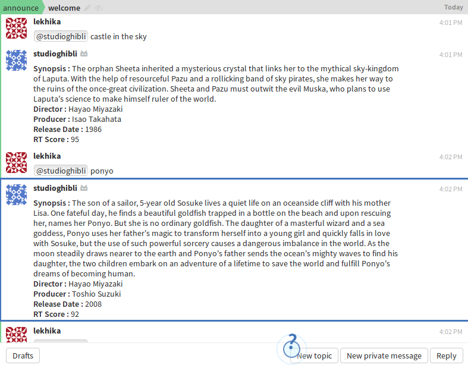

# StudioGhibli-Bot

Studio Ghibli Bot answers all the details of **Studio-ghbili** film or movie that is mentioned.

## Requirements

1. zulip
2. pprint

## Steps to Run

1. Create a zulip realm on [https://zulipchat.com](https://zulipchat.com)
    - Create a Bot on zulip.
    - Go to settings from the gear menu in the top right corner.
    - Create a new generic bot from `Your bots`.
    - Download the bot's zuliprc and save it in your home directory as `.zuliprcc`.
2. Run the Bot using `python3 bot.py`.

## Usage

1. Mention the bot-name in your zulip realm with a title of Studio GHibli film.

## Input
`@studioghibli <studio-ghibli film name>`

## Output
**Synopsis** : synopsis  
**Director** : director  
**Producer** : prioducer  
**Release date** : date of release  
**RT Score** : rt score

